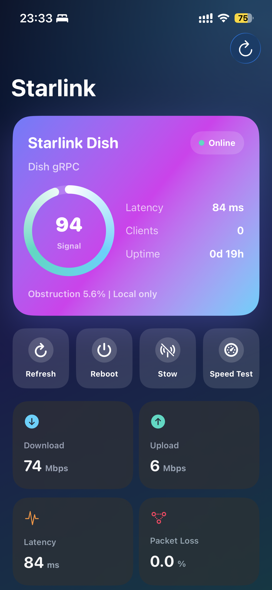
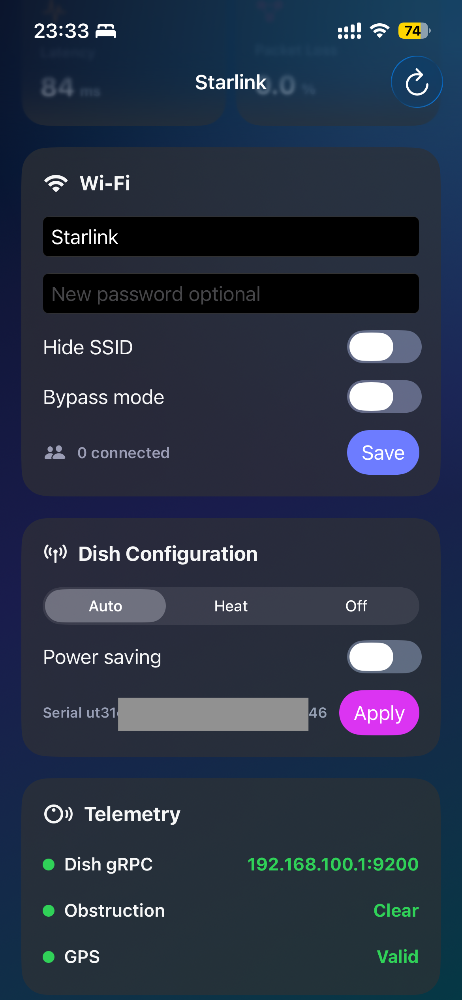
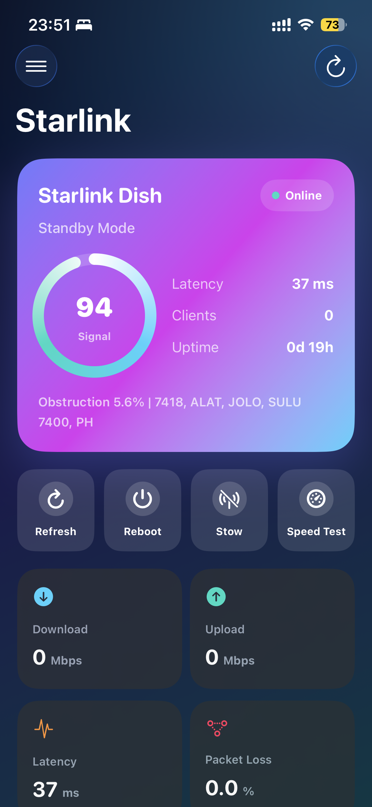
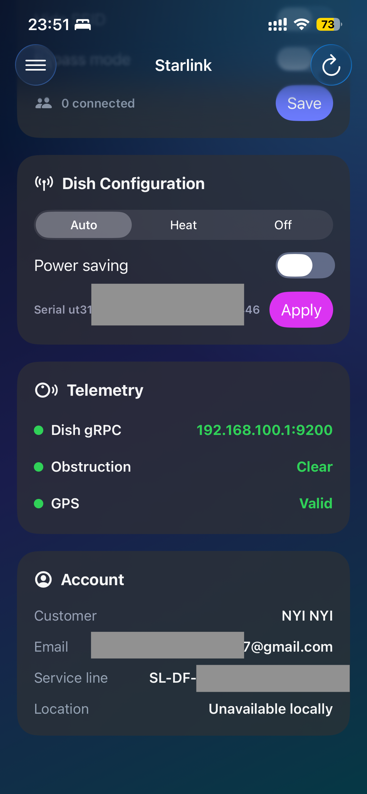

# Starlink Control

Starlink Control is a SwiftUI iOS app for monitoring and controlling a Starlink dish from the local network, with optional Starlink account lookup through a browser cookie.

The app is built with MVVM, a polished gradient dashboard, local gRPC calls generated from [`Eitol/starlink-client`](https://github.com/Eitol/starlink-client), and a side menu for remote account authentication.

## Demo
   Screen 1 | Screen 2
:-------------------------: | :-------------------------:
 |  
 |  

## Features

- Local Starlink dish connection at `192.168.100.1:9200`
- Dish status, uptime, obstruction, GPS validity, latency, throughput, and packet loss
- Quick actions for refresh, reboot, stow, and speed test
- Client-side internet speed test using Cloudflare test endpoints
- Starlink account side menu with saved browser cookie support
- Remote account/service-line details:
  - customer name
  - email
  - service line
  - plan name
  - dish ID
  - router ID
  - service location/address when available
- Keychain storage for the Starlink browser cookie
- Local Network permission and local ATS configuration for iOS

## Architecture

The app follows MVVM:

- `Views/`
  SwiftUI dashboard, side menu, cards, panels, and reusable UI components.

- `ViewModels/`
  `DashboardViewModel` owns app state, loading, actions, account linking, and snapshot merging.

- `Models/`
  Local and remote Starlink data models.

- `Services/`
  Local gRPC service, remote Starlink API client, cookie storage, and mock service.

- `Vendor/starlink-client/`
  Vendored source from `Eitol/starlink-client`, including Starlink protobuf definitions.

- `Tools/buf`
  Local Buf binary used to generate Swift protobuf/gRPC files.

## Requirements

- Xcode 16 or newer
- iOS 17 or newer
- SwiftUI
- Swift Package Manager dependencies:
  - `SwiftProtobuf`
  - `GRPC`
  - `NIO`
  - `NIOConcurrencyHelpers`

For real Starlink data, the iPhone must be connected to the Starlink Wi-Fi network or otherwise able to reach:

```text
192.168.100.1:9200
```

## Build

Open the project in Xcode:

```bash
open StarlinkControl.xcodeproj
```

Or build from Terminal:

```bash
xcodebuild -project StarlinkControl.xcodeproj -scheme StarlinkControl -sdk iphonesimulator -configuration Debug build
```

## Local Starlink Access

The local dish service uses gRPC over the Starlink management address:

```text
192.168.100.1:9200
```

On first launch, iOS may ask for Local Network permission. Allow it, otherwise the app cannot talk to the dish.

If local data does not load:

- Confirm the phone is connected to Starlink Wi-Fi.
- Disable VPN or iCloud Private Relay while testing.
- Confirm Local Network permission is enabled in iOS Settings.
- Try refreshing after Starlink has finished booting.

## Starlink Account Cookie

Some data is not available from local dish gRPC alone, especially customer/account/service-line data. The app can load this through Starlink's remote API if you paste a browser cookie.

To get the cookie:

1. Log in to [starlink.com](https://www.starlink.com/) in a desktop browser.
2. Open browser developer tools.
3. Go to the Network tab.
4. Refresh the Starlink page.
5. Click a request to `starlink.com` or `api.starlink.com`.
6. Copy the `Cookie` request header.
7. Open the app side menu.
8. Paste the cookie into `Browser Cookie`.
9. Tap `Connect Account`.

The app also accepts exported browser-cookie JSON from a cookie extension. Cookies are saved in iOS Keychain and can be removed with `Remove Saved Cookie`.

## What Works Locally

These features work through local Starlink dish gRPC when the iPhone is on the Starlink network:

- Refresh dish status
- Read local telemetry
- Read obstruction status
- Read GPS validity
- Read latency and current throughput fields exposed by the dish
- Reboot dish
- Stow dish

## What Uses Remote Account Auth

These features need a valid Starlink browser cookie:

- Customer name
- Email
- Service line
- Plan name
- Dish ID from the service line
- Router ID from the service line
- Service address/location when Starlink returns it

## Current Limitations

- Starlink's local `StartSpeedtest` gRPC method can return `Unimplemented` on some dish/router firmware. The app uses a client-side Cloudflare speed test instead.
- Wi-Fi configuration writes and dish configuration writes are stubbed with clear errors because they require authenticated/signed Starlink router requests.
- Local gRPC does not provide customer account identity. Use the side-menu cookie flow for account data.
- Cookie validity depends on Starlink session rules. If Starlink rejects it, log in again and paste a fresh cookie.

## Important Files

```text
StarlinkControl/StarlinkControlApp.swift
StarlinkControl/Views/DashboardView.swift
StarlinkControl/Views/Components.swift
StarlinkControl/ViewModels/DashboardViewModel.swift
StarlinkControl/Models/StarlinkModels.swift
StarlinkControl/Models/RemoteStarlinkModels.swift
StarlinkControl/Services/GeneratedStarlinkService.swift
StarlinkControl/Services/StarlinkRemoteClient.swift
StarlinkControl/Services/StarlinkCookieStore.swift
StarlinkControl/Resources/Info.plist
Vendor/starlink-client/
```

## Notes

This is an unofficial Starlink app and is not affiliated with SpaceX or Starlink. Starlink APIs and firmware behavior can change, so some calls may need updates when Starlink changes endpoints, protobufs, or authentication rules.
